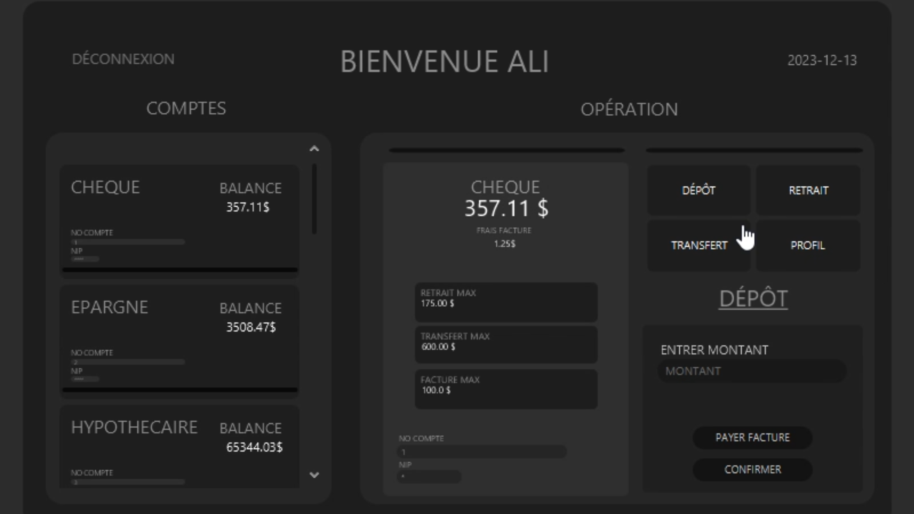
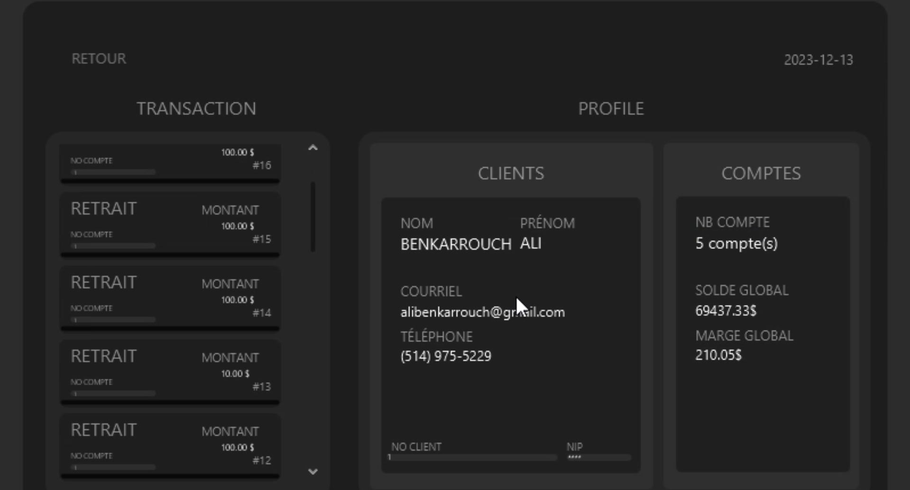
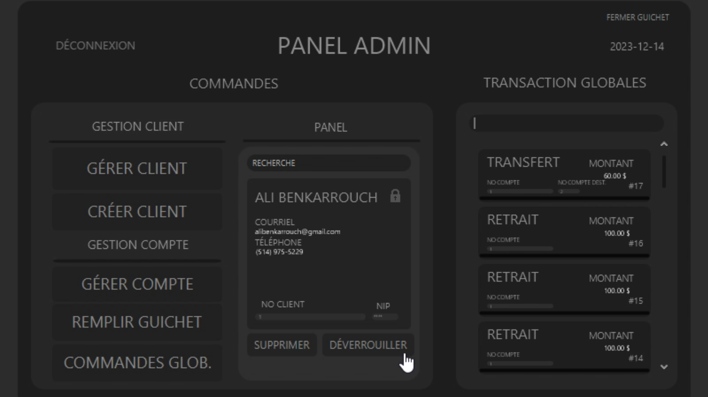

# VantaBank

VantaBank est une application bancaire native développée en JavaFX. Elle permet aux utilisateurs de gérer leurs comptes bancaires, effectuer des transactions, et bien plus encore, dans une interface utilisateur moderne et intuitive.

## Aperçu

Voici un aperçu de l'application VantaBank :







## Fonctionnalités

- **Gestion des comptes** : Créez, modifiez et supprimez des comptes bancaires.
- **Transactions** : Effectuez des dépôts, retraits et transferts entre comptes.
- **Interface utilisateur intuitive** : Navigation fluide et design moderne.
- **Mode administrateur** : Gestion avancée des clients et des comptes pour les administrateurs.

## Prérequis

- **Java** : Version 11 ou supérieure.
- **JavaFX** : Bibliothèque graphique pour Java.
- **IDE** : Recommandé : IntelliJ IDEA ou Visual Studio Code.

## Installation

1. Clonez ce dépôt :

   ```bash
   git clone https://github.com/votre-utilisateur/VantaBank.git
   ```

2. Ouvrez le projet dans votre IDE préféré (recommandé : IntelliJ IDEA).

3. Lancez l'application.
